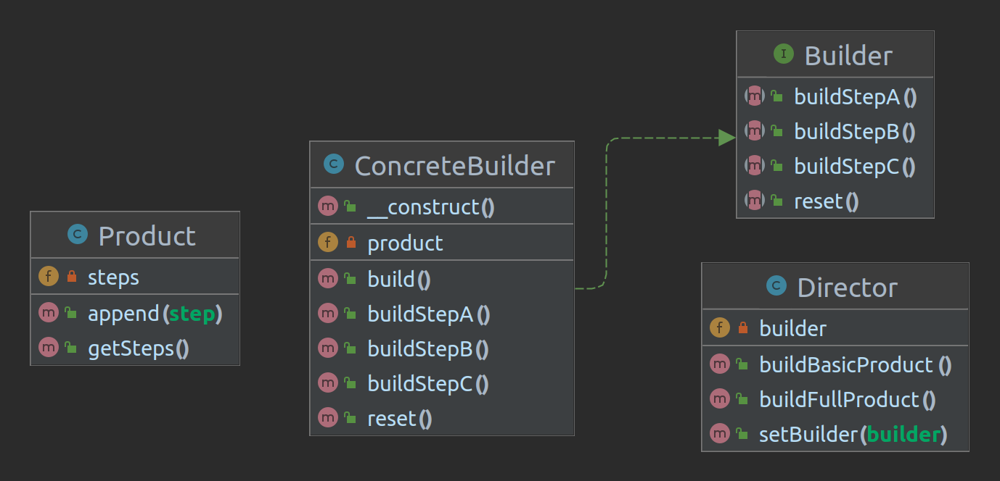
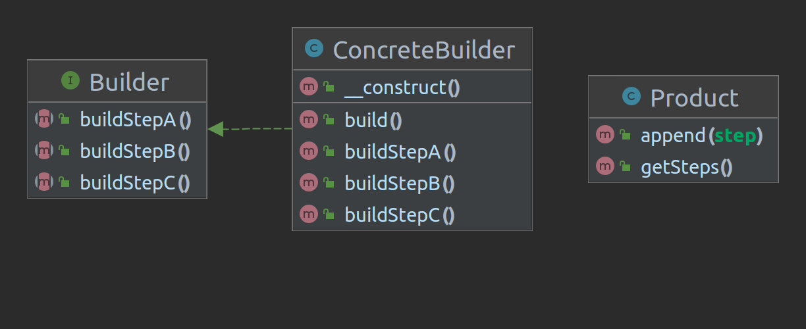

<h1 align="center">ricardokovalski/builder-pattern</h1>

    <strong>Um repositório com os fontes utilizados para explicar o Builder Pattern.</strong>

    
    
    
    

<h2>Sobre</h2>

Este repositório possui fontes escritos na linguagem PHP que explicam o design pattern Builder e suas variações. Além disso, este repositório possui um pequeno exemplo utilizando este padrão.

<h2>Implementação Original</h2>

  

<h2>Implementação Secundária</h2>

  

